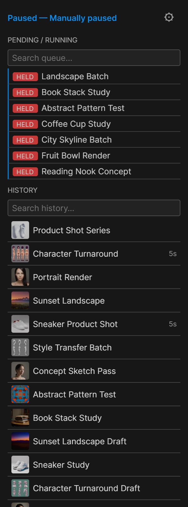
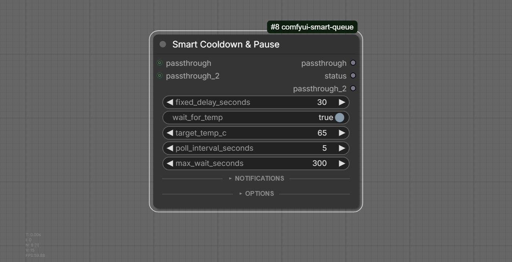
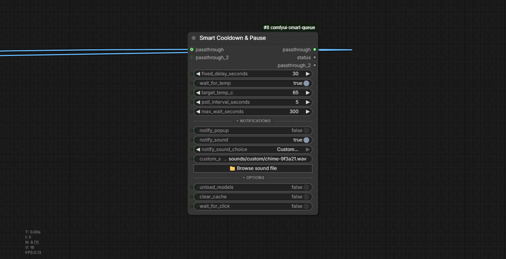

# Smart Queue

GPU-aware queue autopilot for ComfyUI, plus a **Smart Cooldown & Pause** node — for anyone running long batch renders on a single GPU who wants the queue to look after itself.

ComfyUI removed its native pause button and has no built-in way to gate the queue on live GPU state. Smart Queue fills that gap: it watches your GPU (temperature, VRAM headroom, job count) and automatically pauses/resumes the queue, on top of a full persistent queue/history panel with drag-reorder, rename, search, and bulk actions.

## Features

- **Autopilot** — three independent, opt-in rules that pause the queue when your GPU gets too hot, VRAM gets too tight, or too many jobs have run back-to-back. Each has hysteresis (a resume threshold below the pause threshold) so it never flaps. Never interrupts a job that's already running — it only holds back what hasn't started yet.
- **Manual pause** — one click in the toolbar. Holds every not-yet-running job out of ComfyUI's own queue (not just new submissions) and puts it back in the same order on resume. Survives a ComfyUI restart.
- **Persistent queue & history panel** (left sidebar) — survives restarts, shows readable job names (read from the workflow itself, no extra node needed), thumbnails in history with click-to-restore, per-job duration, and a live GPU temp/VRAM readout (hidden automatically if you already have Crystools installed, so you don't get two gauges).
- **Rename, filter/search, auto-archive** — double-click to rename a job, search box above each list, and automatic history cleanup after N days (configurable, off by default).
- **Bulk actions & drag-reorder** — ctrl/shift-click to multi-select, right-click for a context menu (rename / cancel / cancel & requeue), and drag-and-drop priority reordering that actually changes ComfyUI's real execution order.
- **Pause/resume toast notifications** — so an autopilot-triggered pause doesn't go unnoticed just because you weren't looking at the toolbar.
- **Smart Cooldown & Pause node** — an in-graph node for per-workflow control: fixed delay, wait-for-temperature, unload models / clear VRAM cache before waiting, and a manual "wait for click" gate with on-node Continue/Cancel buttons — plus sound and popup notifications when it's done waiting.
- **Fail-open everywhere.** No NVIDIA GPU, no `nvidia-smi`, a bad setting, an exception in the rule engine — the affected feature disables itself and logs a warning. A bug in this pack is never allowed to hang your render queue.

## Installation

Clone (or use ComfyUI Manager) into your `custom_nodes` folder:

```bash
cd ComfyUI/custom_nodes
git clone https://github.com/CraftopiaStudio/comfyui-smart-queue.git
```

No extra Python dependencies — it only shells out to `nvidia-smi`, which ships with any NVIDIA driver. Restart ComfyUI.

## The sidebar panel

Open it from the left toolbar icon (**Smart Queue: GPU autopilot + render queue**). It shows two lists — **Pending/Running** and **History** — each with its own search box, plus a status row with the live GPU readout and a shortcut into **Settings → Smart Queue**. The toolbar also gets its own pause button (next to Run), highlighted blue while paused:


Screenshots below are from a real paused queue (job names are placeholders I renamed for the screenshot — everything else, including the thumbnails, badges and history, is live):



- **Click** a row to select it, **ctrl/cmd-click** to add to the selection, **shift-click** to select a range.
- **Right-click** a row (or a multi-selection) for Rename / Cancel / Cancel & Requeue.
- **Drag** a pending row to reorder it — this changes the real execution order, not just the display.
- A red **HELD** badge marks a job pulled out of the queue by a pause; a green **RUNNING** badge marks the one actually executing right now.

## The Smart Cooldown & Pause node

Drop it anywhere in a graph — typically right before your Save node — and wire an image (or anything else) through its `passthrough` socket so it sits in the execution path. It has two independent passthrough lanes, so one pause point can carry e.g. an image and its mask together.

The node's OPTIONS and NOTIFICATIONS sections are collapsible, so the node stays small until you need them:

| Collapsed (default) | Expanded |
|---|---|
|  |  |

| Input | Default | What it does |
|---|---|---|
| `fixed_delay_seconds` | 30 | Always-applied delay before continuing |
| `wait_for_temp` | on | Polls GPU temperature until it drops under `target_temp_c` (capped by `max_wait_seconds`) |
| `target_temp_c` | 65 | Target temperature for the wait above |
| `poll_interval_seconds` | 5 | How often to re-check the temperature |
| `max_wait_seconds` | 300 | Safety cap so a stuck GPU reading can't wait forever |
| `notify_popup` | off | ComfyUI popup when the node finishes waiting |
| `notify_sound` | off | Plays a short tone (Default / Chime / Alert / a custom sound file you pick) |
| `unload_models` | off | Drops model references from VRAM before waiting |
| `clear_cache` | off | Actually reclaims that VRAM back to the OS/driver (pairs with `unload_models` — this is the step that moves the needle on `nvidia-smi`) |
| `wait_for_click` | off | Blocks after the cooldown behind on-node **▶ Continue** / **✕ Cancel** buttons |
| `passthrough`, `passthrough_2` | — | Two independent pass-through sockets (any type) so the node can sit in-line without breaking your graph |

## Autopilot settings

Under **Settings → Smart Queue**, grouped into sections:

1. **Autopilot** — master on/off for GPU polling itself.
2. **Temperature** — pause above N °C, resume below a lower threshold (hysteresis).
3. **VRAM** — pause when free VRAM drops under a threshold.
4. **Job count** — pause for a configurable cooldown break after N jobs have run back-to-back.
5. **History** — auto-archive completed jobs after N days (0 = never).
6. **Cooldown Node** — `AlwaysToastOnWait`, a fallback popup for a Cooldown node waiting somewhere off-screen.

Every individual rule defaults to **off** — installing this pack for the queue panel alone won't make your renders start pausing themselves without you opting in. The master Autopilot toggle stays on by default so the GPU readout works out of the box.

## Workflow templates

Two ready-to-load examples live in [`workflow-templates/`](workflow-templates/) — drag either `.json` straight onto the ComfyUI canvas (or use **Workflows → Open**):

- **[`cooldown-between-renders.json`](workflow-templates/cooldown-between-renders.json)** — a standard txt2img graph with the Cooldown node between `VAE Decode` and `Save Image`, set to wait for the GPU to drop under 68°C before finishing. Good for long unattended batches.
- **[`manual-pause-wait-for-click.json`](workflow-templates/manual-pause-wait-for-click.json)** — the same graph with `wait_for_click` enabled instead, so every render stops and waits for you to hit **▶ Continue** on the node before it's considered done — useful for reviewing an output before it gets saved, or gating a batch step by step.

Both reference a placeholder checkpoint — swap the **Load Checkpoint** node for your own model after loading.

## Architecture

- Everything rides on ComfyUI's existing aiohttp server — no separate REST server, no hijacking of native routes. The queue-pause mechanism is a middleware registered additively on `POST /prompt`; it's a no-op with zero overhead when autopilot is turned off.
- State (queue, history, held items, manual pause) is kept in a local SQLite database (`smart_queue.sqlite3`), stored under ComfyUI's own `user/` directory (`folder_paths.get_system_user_directory("smart_queue")`) so it survives a restart, an extension update, or a git pull — with a one-time automatic migration from the pre-existing in-extension location if it finds one.
- GPU metrics come from polling `nvidia-smi` in a subprocess — no NVML/pip dependency, no GPU vendor lock-in beyond what `nvidia-smi` itself requires.

## Compatibility & known limitations

- **ComfyUI version.** Built and tested against a current (2026) ComfyUI checkout. The autopilot and queue-hold logic read ComfyUI's in-memory `PromptQueue` directly (`get_current_queue_volatile()`, tuple-shaped queue/history entries) because ComfyUI has no stable public API for queue introspection — a future core refactor of that internal shape could break hold/reorder behavior. Smart Queue checks this shape once at startup and logs a specific warning if it no longer matches, instead of failing silently — if autopilot or the sidebar panel stop reflecting the real queue after a ComfyUI update, check the ComfyUI console log for a `[Smart Queue]` warning first.
- **GPU vendor and selection.** NVIDIA-only (via `nvidia-smi`). On a multi-GPU machine, Smart Queue reads `CUDA_VISIBLE_DEVICES` and polls the first index listed there — set it the same way you'd set it for ComfyUI itself so both agree on which card is "the" GPU. AMD, Intel, and CPU-only installs get `nvidia-smi`-not-found — autopilot's temperature/VRAM rules disable themselves (fail-open) rather than erroring; job-count-based autopilot still works since it doesn't need GPU metrics.
- **Sound/file picker is Windows-only.** The custom-sound picker in the Smart Cooldown & Pause node uses a native Win32 file dialog (PowerShell + `IFileDialog` COM interop). On macOS/Linux the picker endpoint returns immediately with no dialog; everything else in the suite (autopilot, sidebar, cooldown timing, the built-in default/chime/alert sounds) is platform-independent.
- **The cooldown node blocks its branch of the graph while waiting** (fixed delay, temperature-wait, or the manual continue/cancel gate). That's the intended behavior for a gate node, but it means a workflow shouldn't rely on other work happening on that same branch concurrently while it waits.

## Testing

200 unit tests cover the autopilot rule engine, persistence, queue-hold logic, and routes as pure functions with no GPU or running ComfyUI instance required:

```bash
pytest tests/ -q -p no:warnings
```

Frontend behavior (the panel, drag-reorder, the node's widgets, notifications) is verified by hand against a running ComfyUI instance — see `docs/specs/2026-08-28-smart-queue-design.md` for the full history of what's been built and verified, section by section.

## License

See [LICENSE](LICENSE).
